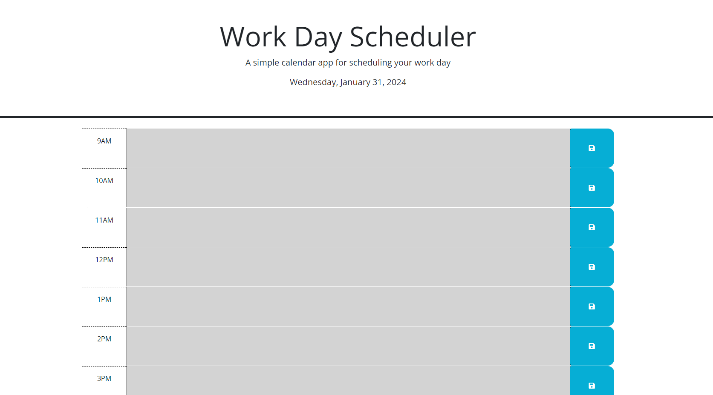

# Work Day Scheduler

## Description

this is a simple application which allows the user to save tasks, or reminders for each hour between 9am and 5pm. the text area's color is updated based on the current hour, grey is past, red is current and green is future. 
text saved in local storage is populated into each time block once the page is loaded.

## Usage

user can save custom text in each time block. current hour is displayed and the current day of the week, month and the year is in the header.

## Code Source

all code was written by Timothy Lee alone. No outside code was utilized, and no other person collaborated on this project.

## Screen Shot

## Link to deployed application

https://timl94.github.io/Work-Day-Scheduler/